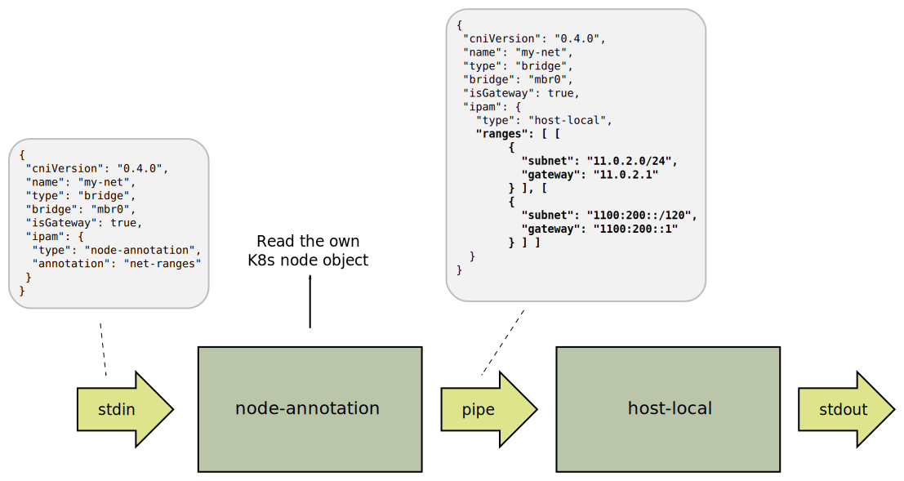

# IPAM CNI-plugin - kube-node and node-annotation

`Kube-node` and `node-annotation` are IPAM [CNI-plugins](
https://github.com/containernetworking/cni) that assigns IP addresses
to PODs based on the Kubernetes node object. `Node-annotation` is an
experimental plugin written with shell scripts. It is kept as a
reference. `Kube-node` is written in go and should be prefered.

For addresses on the main Kubernetes network, `eth0` in PODs, the
address ranges (subnets) are taken from `node.spec.podCIDRs`. This is
automatically generated if the `kube-controller-manager` is started
with `--allocate-node-cidrs=true`. Example:

```bash
# kubectl get node vm-002 -o json | jq .spec.podCIDRs
[
  "11.0.1.0/24",
  "1100:0:0:1::/64"
]
```

```json
{
  "name": "k8snet",
  "cniVersion": "1.0.0",
  "isDefaultGateway": true,
  "ipam": {
    "type": "kube-node",
	"kubeconfig": "/etc/kubernetes/kubeconfig",
    "dataDir": "/run/container-ipam-state/k8snet"
  }
}
```

A few things should be noted. `Kube-node` must be able to read node
objects from the K8s API-server, so it must have a working
`kubeconfig`. This may be omitted if the kubeconfig can be found in
other ways, for instance using the `$KUBECONFIG` environment variable.

`Kube-node` delegates address allocation to the [host-local](
https://www.cni.dev/plugins/current/ipam/host-local/) so the `dataDir`
should be set to a directory that is cleared on node reboot (e.g. a
`tmpfs`).


## Limit IPv4 address allocation

In large clusters IPv4 addresses may become a [limiting resource](
https://github.com/kubernetes/kubernetes/issues/109814#issuecomment-1138840270).
`Kube-node` can be configured to only assign IPv4 address to some namespaces.

```json
{
  "name": "k8snet",
  "cniVersion": "1.0.0",
  "isDefaultGateway": true,
  "ipam": {
    "type": "kube-node",
	"kubeconfig": "/etc/kubernetes/kubeconfig",
    "dataDir": "/run/container-ipam-state/k8snet",
    "ipv4-namespaces": [
        "old-application"
    ]
  }
}
```

**WARNING**: If this is used, Kubernetes must be configured to use
IPv6 addresses for access to the API-server and as default for
services. This is done by specifying an IPv6 address for the
`--advertise-address` and set an IPv6 address first in
`--service-cluster-ip-range` when the `kube-apiserver` is started.


## Secondary networks

if `kube-node` is used to assign addresses on interfaces which are
*not* the Kubernetes network, for instance interfaces added with [Multus](
https://github.com/k8snetworkplumbingwg/multus-cni), the address
ranges (subnets) can be specified in an annotation on the node object.

```bash
# kubectl annotate node vm-002 kube-node.nordix.org/net1=172.20.2.0/24,fd00::2:0:0/96
```

```json
{
  "name": "net1",
  "cniVersion": "1.0.0",
  "isDefaultGateway": true,
  "ipam": {
    "type": "kube-node",
	"kubeconfig": "/etc/kubernetes/kubeconfig",
    "dataDir": "/run/container-ipam-state/net1",
    "annotation": "kube-node.nordix.org/net1"
  }
}
```

## Build

```
./build.sh      # Print help
./build.sh binaries
```


## The node-annotation IPAM

The `node-annotation` is an IPAM [CNI-plugin](
https://github.com/containernetworking/cni) that reads the addresses
from an annotation in the Kubernetes [node object](
https://kubernetes.io/docs/concepts/architecture/nodes/).

Example:
```json
{
    "name": "mynet",
    "type": "ipvlan",
    "master": "eth0",
    "ipam": {
        "type": "node-annotation",
        "annotation": "example.com/ipvlan-ranges"
    }
}
```
And in the node object:
```
# kubectl get node $(hostname) -o json | jq .metadata.annotations
{
  "example.com/ipvlan-ranges": "ranges: [[{\"subnet\": \"172.16.5.0/24\"}]]",
  "node.alpha.kubernetes.io/ttl": "0",
  "volumes.kubernetes.io/controller-managed-attach-detach": "true"
}
```

The `node-annotation` ipam is a wrapper for the [host-local](
https://www.cni.dev/plugins/current/ipam/host-local/) ipam (by
default). *Anything* in the annotation will be inserted in a
`host-local` config. In the figure everything in bold is taken from
the annotation.



This gives you the freedom to use any `host-local` configuration.

For now `node-annotation` is implemented as a shell script. It is
intended mainly for testing.


### Usage

`node-annotation` shall be installed in the cni-bin directory, usually
"/opt/cni/bin". `node-annotation` must be able to get the K8s node
objects using `kubectl get nodes -o json` and analyze with [jq](
https://stedolan.github.io/jq/).

Configuration is in `json` format and is read from
`/etc/cni/node-annotation.conf` or `$NODE_ANNOTATION_CFG`. Example;

```json
{
   "kubeconfig": "/etc/kubernetes/kubeconfig",
   "nextipam": "/opt/cgi/bin/host-local"
}
```

`kubeconfig` is needed unless `$KUBECONFIG` is defined. `nextipam` is
optional and may be used to chain with another plugin than `host-local`.

**NOTE**; a "key" must only contain characters that are valid in a
  shell script variable. That means no dash (-).


### Manual Testing

The `node-annotation` script can be invoked with a parameter to test
some things on a cluster.

```
# /opt/cni/bin/node-annotation -h

 node-annotation --

   An IPAM CNI-plugin that uses annotations on the K8s node object
   https://github.com/Nordix/ipam-node-annotation

 Commands;

   ipam
     Act as an ipam CNI-plugin. This is the default command
   error_quit [msg]
     Print an error in standard CNI json format and quit
   my_node
     Print the own node object
   get_annotation [--node=node] <annotation>
     Print the value of the annotation in the K8s node object

# kubectl annotate node $(hostname) example.com/ipvlan-ranges="\"ranges\": [
  { \"subnet\": \"4000::16.0.0.0/120\" },
  { \"subnet\": \"16.0.0.0/24\" }
]"
# /opt/cni/bin/node-annotation get_annotation example.com/ipvlan-ranges
"ranges": [
  [{ "subnet": "4000::16.0.0.0/120" }],
  [{ "subnet": "16.0.0.0/24" }]
]
```

A test of the entire function;
```
# cat > test.cfg <<EOF
{
    "name": "mynet",
    "type": "ipvlan",
    "master": "eth0",
    "ipam": {
        "type": "node-annotation",
        "annotation": "example.com/ipvlan-ranges"
    }
}
EOF
# export NODE_ANNOTATION_CFG=./nacfg
# cat > $NODE_ANNOTATION_CFG <<EOF
{
  "nextipam": "cat"
}
EOF
cat test.cfg | /opt/cni/bin/node-annotation
{
  "name": "mynet",
  "type": "ipvlan",
  "master": "eth0",
  "ipam": {
    "type": "cat",
    "ranges": [
      {
        "subnet": "4000::16.0.0.0/120"
      },
      {
        "subnet": "16.0.0.0/24"
      }
    ]
  }
}
```


### Kind

If you have [Multus](https://github.com/k8snetworkplumbingwg/multus-cni)
running in [kind](https://kind.sigs.k8s.io/) there are some steps to make
`node-annotation` work.

First copy the `node-annotation` to "/opt/cni/bin" on all workers.

Only the controller have a kubeconfig at "/etc/kubernetes/admin.conf".
Create one at the workers and configure `node-annotation` to use it;

```
kind get kubeconfig --internal | \
  docker exec -i kind-worker tee /etc/kubernetes/kubeconfig > /dev/null
echo "{ \"kubeconfig\": \"/etc/kubernetes/kubeconfig\" }" | docker exec -i kind-worker \
  tee /etc/cni/node-annotation.conf > /dev/null
# (repeat for all workers)
```

The Multus kubeconfig (/etc/cni/net.d/multus.d/multus.kubeconfig)
can't be used due to restrictions.

Now you can annotate the workers and create a NAD. Example;
```
kubectl annotate node worker example.com/bridge="\"ranges\": [
  [{ \"subnet\":\"4000::16.0.0.0/120\", \"rangeStart\":\"4000::16.0.0.0\" , \"rangeEnd\":\"4000::16.0.0.7\"}],
  [{ \"subnet\":\"16.0.0.0/24\", \"rangeStart\":\"16.0.0.0\" , \"rangeEnd\":\"16.0.0.7\"}]
]"
cat | kubectl apply -f - <<EOF
apiVersion: "k8s.cni.cncf.io/v1"
kind: NetworkAttachmentDefinition
metadata:
  name: meridio-bridge
spec:
  config: '{
    "cniVersion": "0.4.0",
    "type": "bridge",
    "bridge": "cbr2",
    "isGateway": true,
    "ipam": {
      "type": "node-annotation",
      "annotation": "example.com/bridge"
    }
  }'
EOF
```
